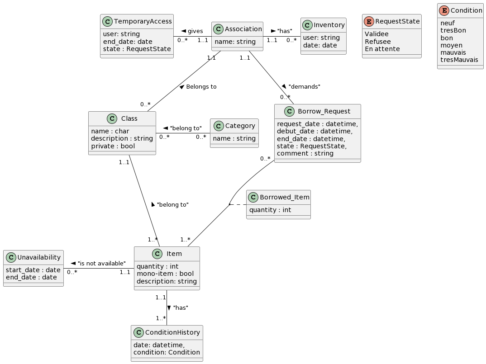
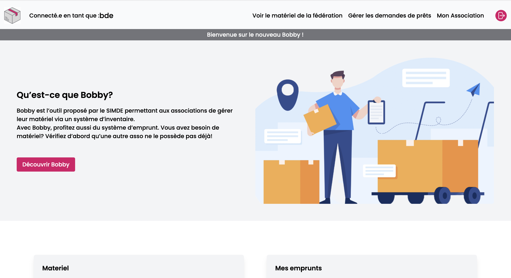
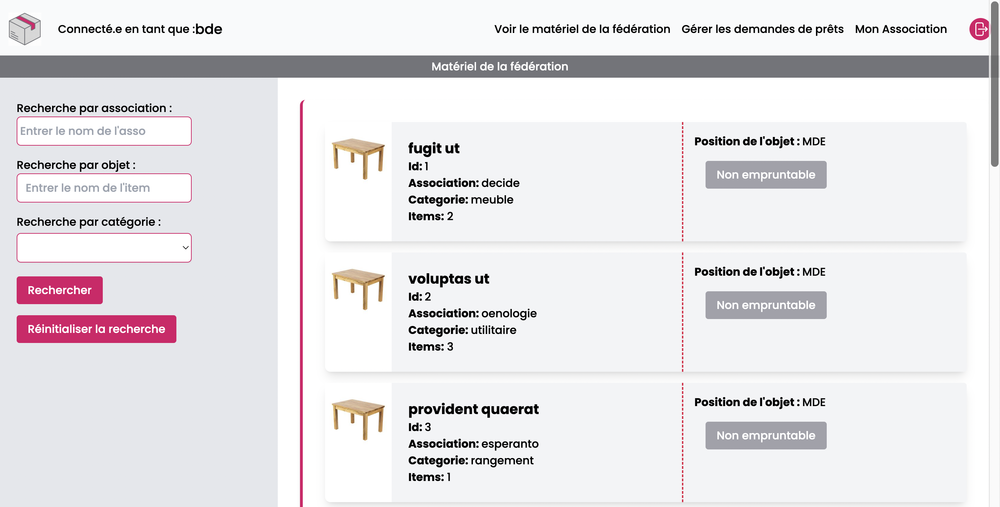
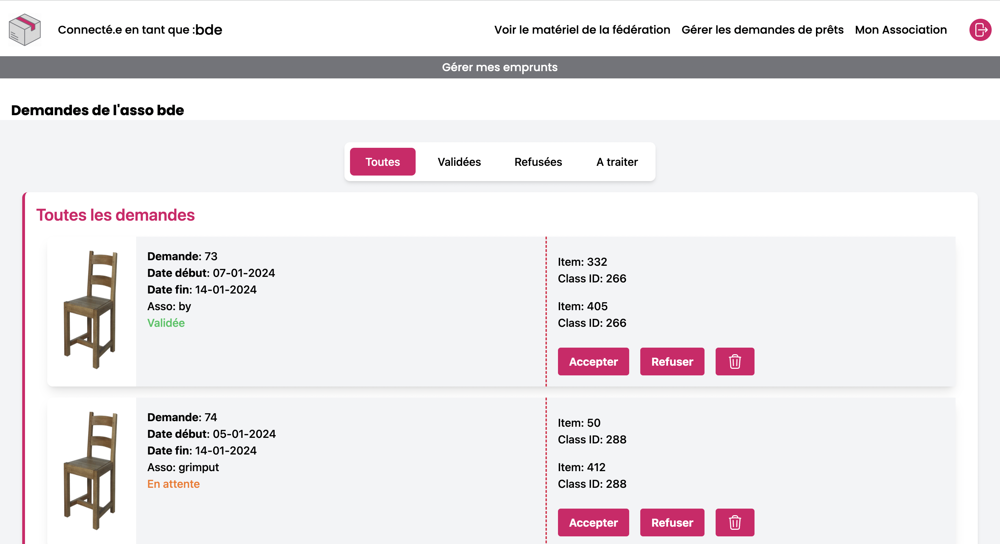
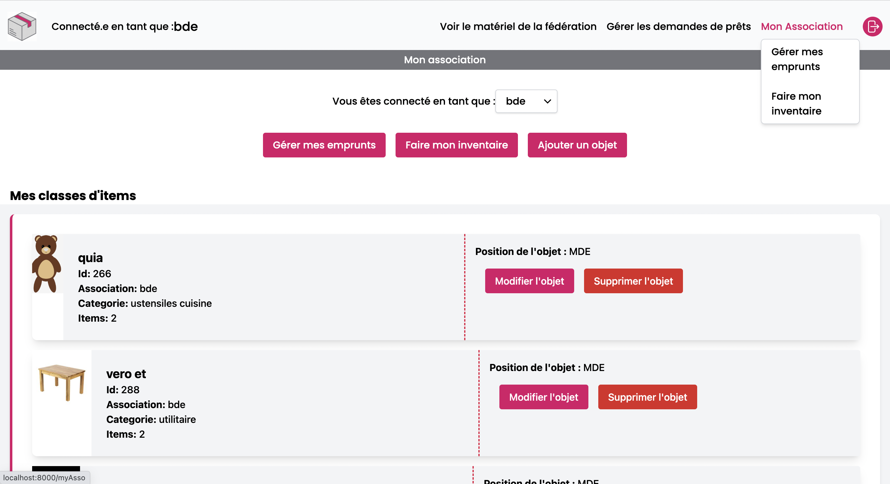

# Nouveau Bobby

## Table des matières

- [Introduction](#introduction)
- [Fonctionalités](#fonctionnalités)
- [Structure du Code](#structure-du-code)
- [Modèle de Données](#modèle-de-données)
- [Installation](#installation)
- [Organisation_générale](#organisation-gérérale)
- [UML](#uml)

## Introduction

Le projet fut de refaire de zéro Bobby, une application Web devant être capable de
permettre aux associations de faire leur inventaire, de le sauvegarder sur la plateforme et si
elles le souhaitent, de proposer leur matériel au prêt pour les autres associations. Elle devra
rendre possible l’individualisation de chaque objet. Quant au prêt, une association peut,
dans le but d’éviter un achat inutile, chercher un objet dont elle aurait besoin sur la
plateforme. Si elle trouve cet objet, elle peut grâce à la plateforme faire la demande de
prêt à l’association propriétaire, qui acceptera ou non le prêt. La trace du prêt sera
sauvegardée sur la plateforme.

## Fonctionnalités
- Pouvoir gérer le matériel de son.ses association.s (Ajout, modifications)
- Voir le matériel des associations de la fédération
- Pouvoir demander un emprunt à une association
- Pouvoir gérer ses demandes d'emprunts en cours
- Pouvoir gérer les prêts en cours de son.ses associations
- Gestion des droits en fonction de la personne connectée 


## Structure du Code
Etant donné que nous avons codé en laravel, le projet suit une organisation MVC. Nous avons utilisé quasiment uniquement du Tailwind pour notre CSS.
Ensuite, nous avons fait plusieurs script ou nous avons utilisé Javascript et parfois sa bibliothèque JQuery.


## Modèle de données


## Installation

1. Clone le repository:

```bash
git https://gitlab.utc.fr/simde/bobby.git
```

2. Lancer l'application en local :

Démarrer le serveur :

```bash
php artisan serve 
```

3. Démarrer le Tailwind :

```bash
npm run dev
```

4. Permettre la gestion et le stockage des images :
```bash
php artisan storage:link
```

## Organisation-gérérale
Il y a quatres principales pages : la page d'accueil, la page de matériel, la page de gestion de demande d'emprunts et la page propre à son association.

<div style="display: flex;">
    
    
</div>

<div style="display: flex;">
    
    
</div>


### Modèles
* BorrowRequests.php : composé d'une date de début, d'une date de fin, de l'id de l'asso, de l'état de l'objet et d'un commentaire
* Category.php : composée d'un nom
* ConditionHistory.php : composé d'un état et d'une date 
* Item.php : composé d'une description, d'une quantité, d'un booléen mono_item
* ItemClass.php :  composé d'un nom, d'une description, d'un booléen private, d'une position, d'une image, d'une quantité et de l'id de l'asso"
* TemporaryAccess.php : composé d'un user, d'une date de fin de prêt, de l'état de l'objet 
* Unavailibility.php : composé d'une date de début et d'une date de fin 
* User.php : composé d'un nom, d'un email et d'un mot de passe


### Contrôleurs
* AssoController.php : Permet le changement d'association (quand une personne est dans plusieurs assos) et la récupération des demandes faites par l'asso 
* BorrowController.php : Permet la gestion des demandes d'emprunts
* Controller.php :
* HomeController.php : Retourne uniquement la vue de la page d'accueil 
* LoginController.php : Gére l'authentification avec le CAS 
* MaterielController.php : Permet la gestion du matériel, avec les ajouts, suppression d'objets, les recherches...

### Vues
* welcome.blade.php : gére la connexion au portail des assos
* home.blade.php : gére la page d'accueil 
* header.blade.php : header, qui est importé ensuite sur chacune des pages 
* footer.blade.php : footer, qui est ensuite importé sur chacune des pages 
* myAsso.blade.php : Page propre à l'association, permet de gérer son matériel, ses emprunts,  de faire son inventaire...
* materiel.blade.php : Page permettant à n'importe quel membre d'asso de voir le matériel de la fédération et de pouvoir faire une demande de prêt
* borrowRequests.blade.php : Vue permettant la demande d'emprunts
* assRequests.blade.php : Vue permettant la gestion des demandes d'emprunts
* addItems.blade.php : Page permettant de gérer l'ajout d'items à la BDD 

*my-request.blade.php : Component pour les demandes d'emprunts
*objet.blade.php : Component pour l'affichage des objets 
*request.blade.php : Component pour gérer les demandes d'emprunts

## UML

```plantuml
@startuml

skinparam groupInheritance 2

cenum RequestState{
    Validee
    Refusee
    En attente
}

enum Condition{
    neuf
    tresBon
    bon
    moyen
    mauvais
    tresMauvais
}

class ConditionHistory{
    date: datetime,
    condition: Condition
}

class TemporaryAccess{
    user: string
    end_date: date
    state : RequestState
}

class Item{
    quantity : int
    mono-item : bool
    description: string
}

class Class{
    name : char
    description : string
    private : bool
}

class Category{
    name : string
}

class Unavailability{
start_date : date
end_date : date
}

class Borrow_Request{
request_date : datetime,
debut_date : datetime,
end_date : datetime,
state : RequestState,
comment : string
}

class Inventory{
    user: string
    date: date
}

class Association{
    name: string
}
class Borrowed_Item{
    quantity : int 
} 

Class  "1..1" --  "1..*" Item : "belong to" < 
Borrow_Request "0..*" -- "1..*" Item 
(Borrow_Request, Item) . Borrowed_Item
Category "0..*" - "0..*" Class : "belong to" >
Unavailability "1..1" - "0..*" Item : "is not available" <
TemporaryAccess "0..*" - "1..1" Association : gives <
Association "1..1" - "0..*" Inventory : "has" >
Association "1.1" -- "0..*" Class :  Belongs to <
Association "1..1" -- "0..*" Borrow_Request : "demands" >


Item "1..1" -- "1..*" ConditionHistory : "has" >
@enduml
```

