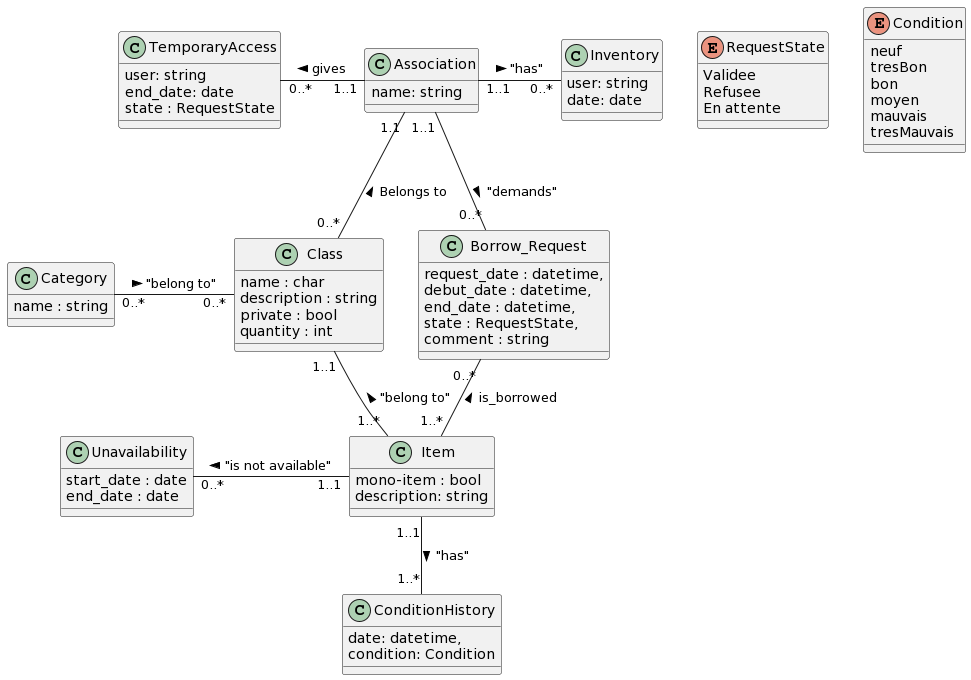

# Nouveau Bobby

## Table des matières

- [Introduction](#introduction)
- [Fonctionalités](#fonctionnalités)
- [Structure du Code](#structure-du-code)
- [Modèle de Données](#modèle-de-données)
- [Installation](#installation)
- [Code de Conduite](#code-de-conduite)

## Introduction

Le projet fut de refaire de zéro Bobby, une application Web devant être capable de
permettre aux associations de faire leur inventaire, de le sauvegarder sur la plateforme et si
elles le souhaitent, de proposer leur matériel au prêt pour les autres associations. Elle devra
rendre possible l’individualisation de chaque objet. Quant au prêt, une association peut,
dans le but d’éviter un achat inutile, chercher un objet dont elle aurait besoin sur la
plateforme. Si elle trouve cet objet, elle peut grâce à la plateforme faire la demande de
prêt à l’association propriétaire, qui acceptera ou non le prêt. La trace du prêt sera
sauvegardée sur la plateforme.

## Fonctionnalités
- Voir le matériel des associations
- Pouvoir gérer le matériel de son.ses association.s 
- Pouvoir demander un emprunt et gérer ses demandes en cours
- Pouvoir gérer les demandes d'emprunt faites à son.ses associations
- Gestion des droits en fonction de la personne connectée 


## Structure du Code
Etant donné que nous avons codé en laravel, le projet suit une organisation MVC. Nous avons utilisé quasiment uniquement du Tailwind pour notre CSS.
Ensuite, nous avons fait plusieurs script ou nous avons utilisé Javascript et parfois sa bibliothèque JQuery.


## Modèle de données



## Organisation-gérérale

###Routes

###Contrôleurs
*AssoController.php
*BorrowController.php
*Controller.php
*HomeController.php 
*LoginController.php
*MaterielController.php

###Vues
*welcome.blade.php : gérer la connexion au portail des assos
*home.blade.php : gère la page d'accueil 
*header.blade.php : 
*footer.blade.php :
*myAsso.blade.php : 
*borrowRequests.blade.php : 
*manageRequests.blade.php : 

*my-request.blade.php :
*objet.blade.php :
*request.blade.php : 

## UML

```puml
@startuml

skinparam groupInheritance 2

cenum RequestState{
    Validee
    Refusee
    En attente
}

enum Condition{
    neuf
    tresBon
    bon
    moyen
    mauvais
    tresMauvais
}

class ConditionHistory{
    date: datetime,
    condition: Condition
}

class TemporaryAccess{
    user: string
    end_date: date
    state : RequestState
}

class Item{
    quantity : int
    mono-item : bool
    description: string
}

class Class{
    name : char
    description : string
    private : bool
}

class Category{
    name : string
}

class Unavailability{
start_date : date
end_date : date
}

class Borrow_Request{
request_date : datetime,
debut_date : datetime,
end_date : datetime,
state : RequestState,
comment : string
}

class Inventory{
    user: string
    date: date
}

class Association{
    name: string
}
class Borrowed_Item{
    quantity : int 
} 

Class  "1..1" --  "1..*" Item : "belong to" < 
Borrow_Request "0..*" -- "1..*" Item 
(Borrow_Request, Item) . Borrowed_Item
Category "0..*" - "0..*" Class : "belong to" >
Unavailability "1..1" - "0..*" Item : "is not available" <
TemporaryAccess "0..*" - "1..1" Association : gives <
Association "1..1" - "0..*" Inventory : "has" >
Association "1.1" -- "0..*" Class :  Belongs to <
Association "1..1" -- "0..*" Borrow_Request : "demands" >


Item "1..1" -- "1..*" ConditionHistory : "has" >
@enduml
```

## Installation

1. Clone le repository:

```bash
git clone https://gitlab.utc.fr/royhucheradorni/ia04.git
```

2. Lancer l'application en local :

Démarrer le serveur :

```bash
php artisan serve 
```

3. Démarrer le Tailwind :

```bash
npm run dev
```

4. Permettre la gestion et le stockage des images :
```bash
php artisan storage:link
```

